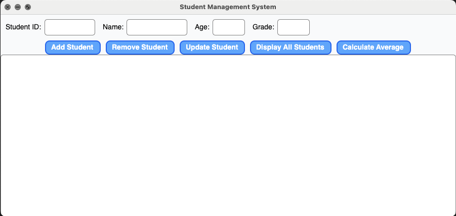

# SMS - Student Management System

## Autor
**AEH**  
Nr albumu: **51333**  
**Kacper Ormaniec**

---

## Opis projektu
Student Management System (SMS) to aplikacja umożliwiająca efektywne zarządzanie danymi studentów. Aplikacja pozwala na dodawanie, edycję, usuwanie oraz wyświetlanie danych studentów z przyjaznym interfejsem użytkownika.

---

## Technologie użyte w projekcie:
- **Język programowania:** C# / .NET 8.0
- **Baza danych:** PostgreSQL (zarządzana przez Docker)
- **ORM:** Entity Framework Core (EF Core)
- **Interfejs użytkownika (GUI):** Avalonia
- **Dependency Injection:** Microsoft.Extensions.DependencyInjection
- **Hostowanie aplikacji:** Microsoft.Extensions.Hosting

---

## Funkcjonalności
1. **Dodawanie studenta**
   - Wprowadzenie danych takich jak ID, Imię, Wiek i Ocena.
   - Walidacja pól (np. wiek w zakresie 1–100, ocena w zakresie 1.00–6.00).
2. **Edycja danych studenta**
   - Możliwość aktualizacji imienia, wieku i oceny.
3. **Usuwanie studenta**
   - Usuwanie studenta za pomocą jego ID.
4. **Wyświetlanie wszystkich studentów**
   - Wygenerowanie listy studentów.
5. **Obliczanie średniej ocen**
   - Średnia obliczana na podstawie wszystkich danych.

---

## Wymagania systemowe
- **Platformy:** Windows, macOS, Linux
- **Baza danych:** PostgreSQL (Docker zalecany)
- **.NET SDK:** Wersja 8.0 lub nowsza
- **Docker:** Wymagany do uruchomienia bazy danych PostgreSQL

---

## Instrukcja uruchomienia

### Konfiguracja bazy danych
1. Uruchom bazę danych PostgreSQL za pomocą Dockera:
   ```bash
   docker run --name student_management_db -e POSTGRES_USER=postgres -e POSTGRES_PASSWORD=postgres -e POSTGRES_DB=students -p 5432:5432 -d postgres
   ```
2. Upewnij się, że konfiguracja połączenia w `appsettings.json` zawiera poprawny connection string:
   ```json
   {
       "Database": {
           "ConnectionStrings": {
               "Postgres": "Host=localhost;Port=5432;Database=students;Username=postgres;Password=postgres"
           }
       }
   }
   ```

### Migracje
1. Zainstaluj narzędzie CLI dla EF Core:
   ```bash
   dotnet tool install --global dotnet-ef
   ```
2. Wygeneruj migracje:
   ```bash
   dotnet ef migrations add InitialCreate --project studentManagementSystem.Data --startup-project studentManagementSystem.Gui
   ```
3. Zastosuj migracje:
   ```bash
   dotnet ef database update --project studentManagementSystem.Data --startup-project studentManagementSystem.Gui
   ```

---

## Instrukcja kompilacji i uruchomienia
1. Skonfiguruj środowisko (Docker, .NET SDK, PostgreSQL).
2. Uruchom aplikację za pomocą Visual Studio, Rider lub CLI:
   ```bash
   dotnet run --project studentManagementSystem.Gui
   ```

---

## Kluczowe pliki projektu

### 1. **DbContext – `StudentDbContext`**
Klasa zarządza mapowaniem danych studentów do tabeli PostgreSQL.
```csharp
public class StudentDbContext : DbContext
{
    public DbSet<Student> Students { get; set; }
    protected override void OnModelCreating(ModelBuilder modelBuilder)
    {
        modelBuilder.Entity<Student>(entity => entity.HasKey(e => e.StudentId));
    }
}
```

### 2. **Repozytorium – `StudentRepository`**
Odpowiada za komunikację z bazą danych.
```csharp
public class StudentRepository : IStudentRepository
{
    private readonly StudentDbContext _context;
    public void Add(Student student) => _context.Students.Add(student);
    public void Remove(Student student) => _context.Students.Remove(student);
    public Student GetById(string id) => _context.Students.Find(id);
    public List<Student> GetAll() => _context.Students.ToList();
    public double CalculateAverageGrade() => _context.Students.Average(s => s.Grade);
}
```

### 3. **Logika biznesowa – `StudentManager`**
Obsługuje walidację i operacje na studentach.
```csharp
public class StudentManager : IStudentManager
{
    private readonly IStudentRepository _repository;
    public void AddStudent(Student student)
    {
        if (student.Age < 1 || student.Age > 100) throw new ArgumentException("Invalid age");
        _repository.Add(student);
    }
}
```

### 4. **Interfejs użytkownika – `MainWindow`**
Interfejs graficzny obsługujący zdarzenia użytkownika.
```csharp
public partial class MainWindow : Window
{
    private readonly IStudentManager _studentManager;
    public MainWindow(IServiceProvider serviceProvider)
    {
        _studentManager = serviceProvider.GetRequiredService<IStudentManager>();
    }
}
```

---

## Testowanie

### Narzędzia testowe
Testy jednostkowe zostały zaimplementowane za pomocą **xUnit** oraz biblioteki **Shouldly**. 

### Scenariusze testowe
#### StudentRepositoryTests
- `Add_ShouldAddStudentToDatabase`: Testuje poprawność dodawania studenta do bazy danych.
- `GetById_ShouldReturnCorrectStudent`: Sprawdza poprawność pobierania studenta po ID.
- `Remove_ShouldRemoveStudentFromDatabase`: Weryfikuje usuwanie studenta z bazy danych.
- `GetAll_ShouldReturnAllStudents`: Testuje poprawność zwracania listy studentów.
- `CalculateAverageGrade_ShouldReturnCorrectAverage`: Sprawdza poprawność obliczania średniej ocen.
- `CalculateAverageGrade_ShouldReturnZero_WhenNoStudentsExist`: Weryfikuje zachowanie metody, gdy w bazie nie ma studentów.

#### StudentManagerTests
- `AddStudent_ShouldThrow_WhenNameIsEmpty`: Weryfikuje walidację pustego imienia.
- `AddStudent_ShouldThrow_WhenAgeIsOutOfRange`: Sprawdza walidację zakresu wieku.
- `AddStudent_ShouldCallRepositoryAdd_WhenValidStudent`: Weryfikuje, czy poprawny student jest dodawany do repozytorium.
- `RemoveStudent_ShouldThrow_WhenStudentNotFound`: Testuje obsługę wyjątku, gdy student nie istnieje.
- `RemoveStudent_ShouldCallRepositoryRemove_WhenStudentExists`: Sprawdza poprawność usuwania studenta w repozytorium.

---

## Wygląd aplikacji



